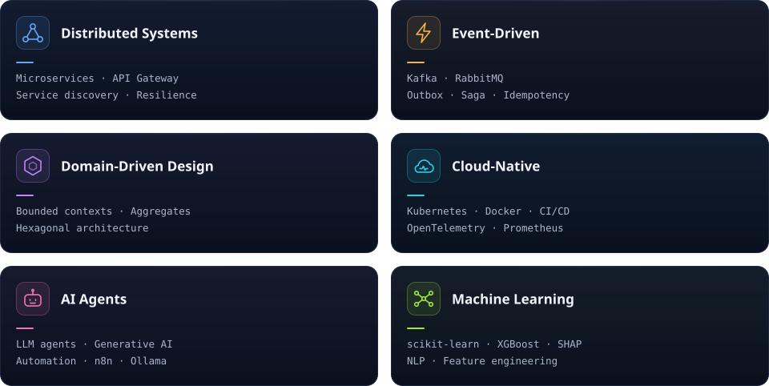
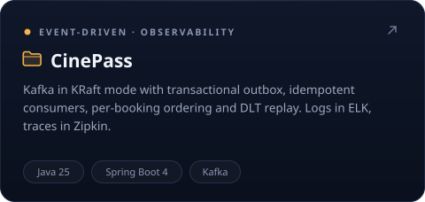
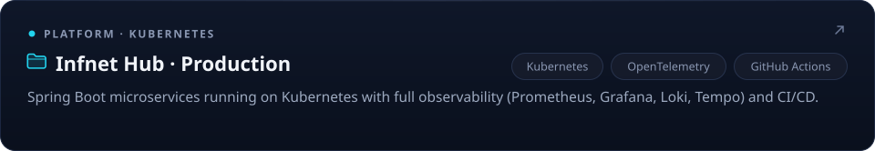
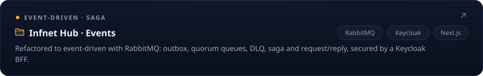
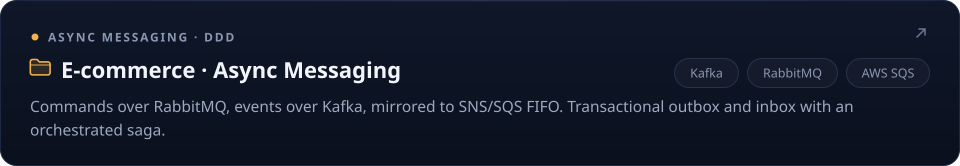
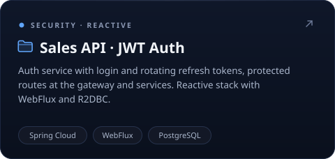
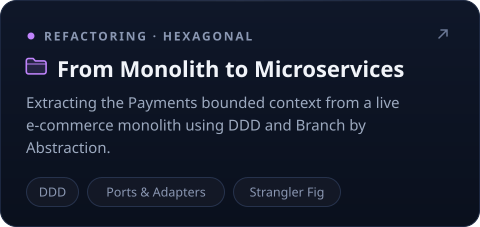
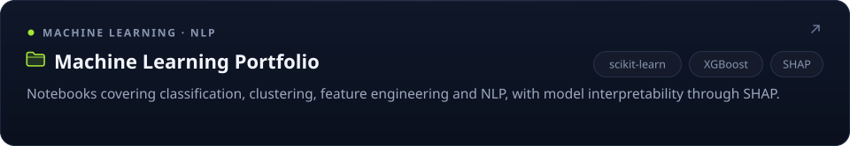
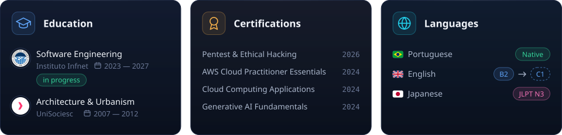

<!-- Gerado por scripts/build_assets.py — edite os textos lá e rode: python scripts/build_assets.py -->

  <a href="https://andrebecker84.github.io/my-links/"><picture><source media="(max-width: 640px)" srcset="assets/en/my-links-pill-m.svg"></picture></a> <a href="https://github.com/andrebecker84/andrebecker84/blob/main/README.pt-BR.md"><picture><source media="(max-width: 640px)" srcset="assets/en/lang-m.svg"></picture></a>

  <picture><source media="(max-width: 640px)" srcset="assets/en/now-m.svg"></picture><a href="https://andrebecker84.github.io/my-links/"><picture><source media="(max-width: 640px)" srcset="assets/en/my-links-m.svg"></picture></a>

  <picture><source media="(max-width: 640px)" srcset="assets/en/hero-m.svg"></picture>

  <picture><source media="(max-width: 640px)" srcset="assets/en/section-about-m.svg"><source media="(prefers-color-scheme: light)" srcset="assets/en/section-about-light.svg"></picture>

  <picture><source media="(max-width: 640px)" srcset="assets/en/about-m.svg"></picture>

  <picture><source media="(max-width: 640px)" srcset="assets/en/section-journey-m.svg"><source media="(prefers-color-scheme: light)" srcset="assets/en/section-journey-light.svg"></picture>

  <picture><source media="(max-width: 640px)" srcset="assets/en/journey-m.svg"><source media="(prefers-color-scheme: light)" srcset="assets/en/journey-light.svg"></picture>

  <picture><source media="(max-width: 640px)" srcset="assets/en/section-focus-m.svg"><source media="(prefers-color-scheme: light)" srcset="assets/en/section-focus-light.svg"></picture>

  <picture><source media="(max-width: 640px)" srcset="assets/en/focus-m.svg"></picture>

  <picture><source media="(max-width: 640px)" srcset="assets/en/section-work-m.svg"><source media="(prefers-color-scheme: light)" srcset="assets/en/section-work-light.svg"></picture>

  <a href="https://github.com/andrebecker84/cinepass-ddd-event-driven-AT"><picture><source media="(max-width: 640px)" srcset="assets/en/project-cinepass-m.svg"></picture></a>
  <a href="https://github.com/andrebecker84/TP5-PB_producao"><picture><source media="(max-width: 640px)" srcset="assets/en/project-infnet-hub-prod-m.svg"></picture></a>
  <a href="https://github.com/andrebecker84/TP4-PB_eventos"><picture><source media="(max-width: 640px)" srcset="assets/en/project-infnet-hub-events-m.svg"></picture></a>
  <a href="https://github.com/andrebecker84/ecommerce-ddd-async-messaging-TP3"><picture><source media="(max-width: 640px)" srcset="assets/en/project-async-messaging-m.svg"></picture></a>
  <a href="https://github.com/andrebecker84/microservices-devops-api-vendas-TP3"><picture><source media="(max-width: 640px)" srcset="assets/en/project-jwt-auth-m.svg"></picture></a>
  <a href="https://github.com/andrebecker84/ecommerce-ddd-refactoring-TP1"><picture><source media="(max-width: 640px)" srcset="assets/en/project-monolith-to-ms-m.svg"></picture></a>
  <a href="https://github.com/andrebecker84/ml-portfolio"><picture><source media="(max-width: 640px)" srcset="assets/en/project-ml-portfolio-m.svg"></picture></a>

  

  <picture><source media="(max-width: 640px)" srcset="assets/en/section-education-m.svg"><source media="(prefers-color-scheme: light)" srcset="assets/en/section-education-light.svg"></picture>

  <picture><source media="(max-width: 640px)" srcset="assets/en/education-m.svg"></picture>

  <picture><source media="(max-width: 640px)" srcset="assets/en/section-toolbox-m.svg"><source media="(prefers-color-scheme: light)" srcset="assets/en/section-toolbox-light.svg"></picture>

   
  <picture><source media="(max-width: 640px)" srcset="assets/en/caption-languages-m.svg"><source media="(prefers-color-scheme: light)" srcset="assets/en/caption-languages-light.svg"></picture>

   
  <picture><source media="(max-width: 640px)" srcset="assets/en/caption-messaging-m.svg"><source media="(prefers-color-scheme: light)" srcset="assets/en/caption-messaging-light.svg"></picture>

   
  <picture><source media="(max-width: 640px)" srcset="assets/en/caption-platform-m.svg"><source media="(prefers-color-scheme: light)" srcset="assets/en/caption-platform-light.svg"></picture>

  <picture><source media="(max-width: 640px)" srcset="assets/en/section-connect-m.svg"><source media="(prefers-color-scheme: light)" srcset="assets/en/section-connect-light.svg"></picture>

  <a href="https://www.linkedin.com/in/becker84"><picture><source media="(max-width: 640px)" srcset="assets/blank-line.svg"></picture></a>
  <a href="https://andrebecker84.github.io/my-links/#contato"><picture><source media="(max-width: 640px)" srcset="assets/blank-line.svg"></picture></a>
  <a href="https://andrebecker84.github.io/my-links/"><picture><source media="(max-width: 640px)" srcset="assets/blank-line.svg"></picture></a>
  <a href="https://www.linkedin.com/in/becker84"><picture><source media="(max-width: 640px)" srcset="assets/en/link-linkedin-m.svg"></picture></a>
  <a href="https://andrebecker84.github.io/my-links/#contato"><picture><source media="(max-width: 640px)" srcset="assets/en/link-contact-m.svg"></picture></a>
  <a href="https://andrebecker84.github.io/my-links/"><picture><source media="(max-width: 640px)" srcset="assets/en/link-links-m.svg"></picture></a>

  <picture><source media="(max-width: 640px)" srcset="assets/en/footer-m.svg"><source media="(prefers-color-scheme: light)" srcset="assets/en/footer-light.svg"></picture>

